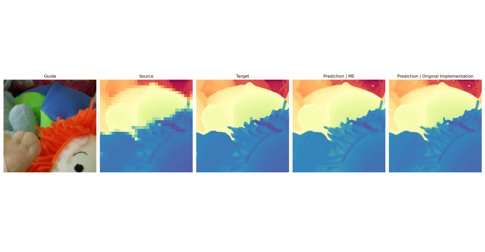

## Codeway Case-Study

### Re-implementation of [Guided Super-Resolution as Pixel-to-Pixel Transformation](https://arxiv.org/abs/1904.01501)
Re-implemeted by,
* Halil Çağrı Bilgi - cagri.bilgi@metu.edu.tr

Qualitative Comparison of Re-implementation with original one.
